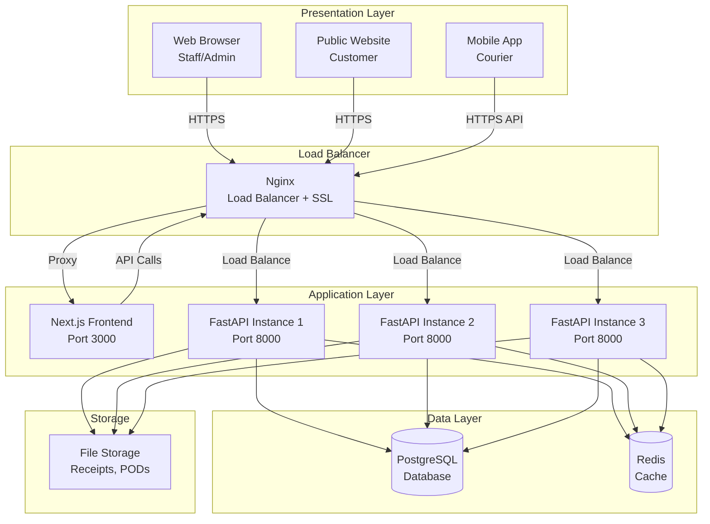
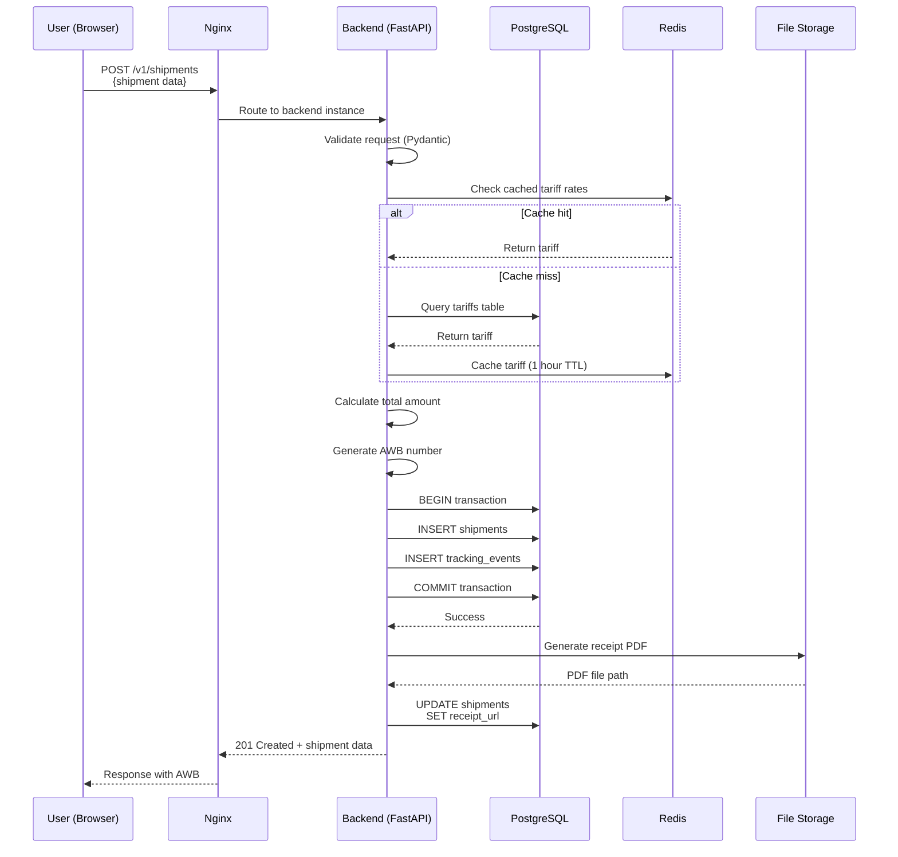
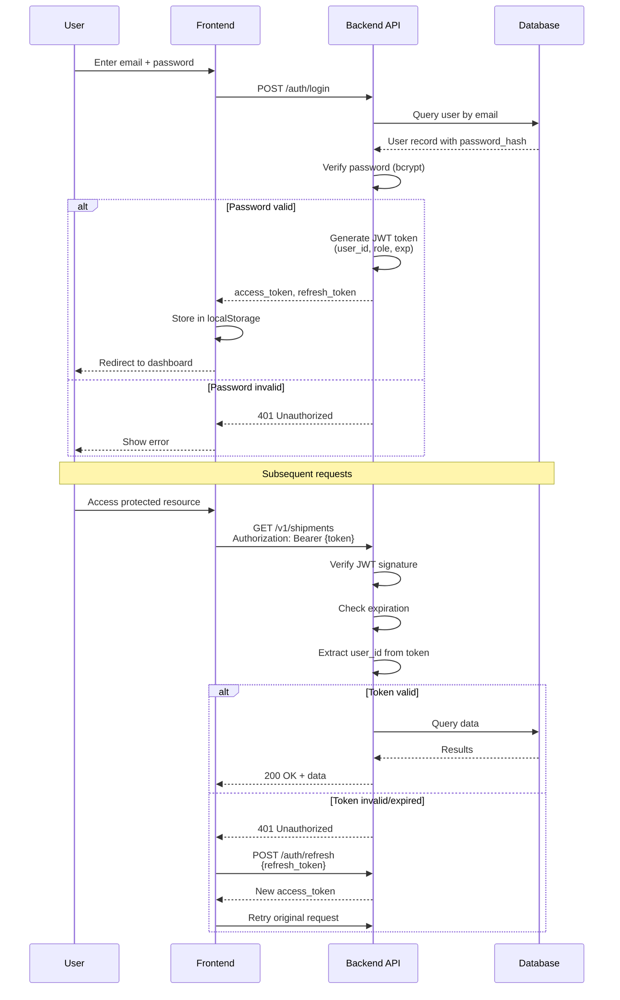

# System Architecture - DAPK Logistics System

Complete system design and architecture overview.

---

## Architecture Overview

DAPK uses a modern **microservices-inspired** architecture with clear separation of concerns:

- **Presentation Layer**: Next.js frontend, Mobile apps
- **Application Layer**: FastAPI backend instances (horizontally scaled)
- **Data Layer**: PostgreSQL database, Redis cache
- **Infrastructure Layer**: Docker containers, Nginx load balancer



---

## Three-Tier Architecture

### 1. Presentation Tier

**Components**:
- **Next.js Application** - Core system web interface for staff
- **React Components** - UI components with TypeScript
- **Mobile Apps** (Future) - Native Android/iOS for couriers
- **Progressive Web App** - Courier mobile app (Phase 1)

**Responsibilities**:
- User interface rendering
- Form validation (client-side)
- State management
- API consumption
- SEO optimization (Next.js SSR)

**Technology Stack**:
- Next.js 14 (React 18)
- TypeScript
- Tailwind CSS
- React Context / Zustand for state
- Axios for API calls

---

### 2. Application Tier

**Components**:
- **FastAPI Backend** (3+ instances)
- **Business Logic Layer**
- **API Endpoints** (REST)
- **Background Tasks** (optional with Celery)

**Responsibilities**:
- Business logic execution
- Request validation (Pydantic)
- Database operations via ORM
- Authentication & authorization (JWT)
- File operations (PDFs, images)
- API documentation (auto-generated)

**Technology Stack**:
- FastAPI (Python 3.11+)
- SQLAlchemy (async ORM)
- Pydantic (validation)
- python-jose (JWT)
- ReportLab (PDF generation)
- Pillow (image processing)

**Design Patterns**:
- **Repository Pattern** - Data access abstraction
- **Service Layer** - Business logic separation
- **Dependency Injection** - FastAPI native
- **Factory Pattern** - Object creation

---

### 3. Data Tier

**Components**:
- **PostgreSQL Database** - Primary data store
- **Redis Cache** (optional) - Session and data caching
- **File Storage** - Receipts, POD photos, documents

**Responsibilities**:
- Persistent data storage
- Transactional integrity (ACID)
- Data relationships and constraints
- Full-text search (PostgreSQL)
- Session storage (Redis)

**Technology Stack**:
- PostgreSQL 15+ with extensions (uuid-ossp, pg_trgm)
- Redis 7 (optional)
- Local volume storage or S3-compatible object storage

---

## Component Details

### Nginx Load Balancer

**Purpose**: SSL termination, load balancing, reverse proxy

**Configuration**:
- **Algorithm**: Least connections (least_conn)
- **Health Checks**: Passive (max_fails=3, fail_timeout=30s)
- **SSL/TLS**: Terminates HTTPS, proxies HTTP to backends
- **WebSocket Support**: For real-time tracking updates

**Features**:
- HTTP to HTTPS redirect
- Static file caching
- Gzip compression
- Security headers injection
- Request logging

**Upstream Servers**:
```nginx
upstream backend_api {
    least_conn;
    server backend-1:8000 max_fails=3 fail_timeout=30s;
    server backend-2:8000 max_fails=3 fail_timeout=30s;
    server backend-3:8000 max_fails=3 fail_timeout=30s;
    keepalive 32;
}
```

---

### FastAPI Backend Instances

**Purpose**: API server handling business logic

**Characteristics**:
- **Stateless**: No session storage in memory
- **Horizontal Scaling**: Can add/remove instances dynamically
- **Async I/O**: Handles concurrent requests efficiently
- **Auto Documentation**: Swagger UI at `/docs`

**Project Structure**:
```
backend/
├── app/
│   ├── main.py              # FastAPI app initialization
│   ├── api/
│   │   └── v1/
│   │       ├── endpoints/   # Route handlers
│   │       └── dependencies.py
│   ├── core/
│   │   ├── config.py        # Settings (from env vars)
│   │   ├── security.py      # JWT, password hashing
│   │   └── database.py      # DB connection, session
│   ├── models/              # SQLAlchemy ORM models
│   ├── schemas/             # Pydantic request/response schemas
│   ├── services/            # Business logic layer
│   ├── repositories/        # Data access layer
│   └── utils/               # Helper functions
├── tests/
├── alembic/                 # Database migrations
├── requirements.txt
└── Dockerfile
```

**Key Features**:
- **Connection Pooling**: Reuses DB connections (pool_size=20)
- **Request Validation**: Automatic with Pydantic
- **Error Handling**: Centralized exception handlers
- **Logging**: Structured logging with request tracing
- **CORS**: Configured for frontend domains

---

### PostgreSQL Database

**Purpose**: Primary data store with ACID guarantees

**Configuration**:
- **Version**: 15+ (for gen_random_uuid)
- **Extensions**: uuid-ossp, pg_trgm
- **Connection Limit**: 100 connections
- **Encoding**: UTF-8
- **Timezone**: UTC

**Optimization**:
- **Indexes**: Composite indexes on common query patterns
- **Partitioning**: For large tables (shipments, tracking_events)
- **Vacuum**: Regular autovacuum
- **Backup**: Daily full backup, WAL archiving

**Connection Pooling** (SQLAlchemy):
```python
engine = create_async_engine(
    DATABASE_URL,
    pool_size=20,          # Connections per instance
    max_overflow=10,       # Additional connections when busy
    pool_pre_ping=True,    # Verify connection before use
    pool_recycle=3600      # Recycle connections every hour
)
```

**Total Connections Needed**:
- 3 backend instances × 20 pool_size = 60 connections
- Plus overhead (admin, migrations) = ~70-80 connections
- PostgreSQL default max_connections=100 is sufficient
- Can increase if scaling beyond 4-5 backend instances

---

### Redis Cache (Optional)

**Purpose**: High-speed caching and session storage

**Use Cases**:
- **Tariff Rates**: Cache frequently accessed tariff calculations
- **Warehouse Data**: Cache master data (warehouses, origins, destinations)
- **Session Storage**: User sessions and JWT blacklist
- **Rate Limiting**: Track API request counts per IP/user

**Data TTL (Time To Live)**:
- Tariff rates: 1 hour
- Master data: 30 minutes
- Sessions: Match JWT expiry (24 hours)
- Tracking data: 5 minutes

**Cache Strategy**:
- **Cache-aside pattern**: Application checks cache, falls back to DB
- **Write-through**: Update cache when DB updated
- **Invalidation**: Clear cache on master data changes

---

### File Storage

**Purpose**: Store generated documents and uploaded files

**File Types**:
- **Receipts**: PDF files with barcodes (generated)
- **POD Photos**: JPEG images from courier mobile app
- **Signatures**: PNG images (digital signatures)
- **Manifest Documents**: PDF files
- **Surat Jalan**: PDF files with signatures

**Storage Strategy**:

**Phase 1 (Local Volume)**:
- Shared Docker volume between backend instances
- Path: `/app/uploads/`
- Organized by type: `/uploads/receipts/`, `/uploads/pod/`, etc.
- File naming: `{type}_{id}_{timestamp}.{ext}`

**Phase 2 (Object Storage)** (Future):
- MinIO or S3-compatible storage
- CDN for fast delivery
- Pre-signed URLs for secure downloads
- Automatic compression and optimization

---

## Data Flow

### Example: Create Shipment



**Key Points**:
1. Nginx routes to least-busy backend
2. Pydantic validates all input
3. Redis caches tariff rates
4. Database transaction ensures atomicity
5. PDF generated asynchronously (or sync, based on requirements)
6. Tracking event created for audit trail

---

## Security Architecture

### Authentication Flow



---

### Authorization (Role-Based Access Control)

**Roles**:
- **admin**: Full system access
- **supervisor**: Create manifests, runsheets, reports
- **warehouse_staff**: Create shipments, process arrivals
- **finance**: Cash register verification
- **courier**: Mobile app access, POD submission
- **customer**: Track own shipments, view invoices

**Permission Matrix**:

| Resource | Admin | Supervisor | Staff | Finance | Courier | Customer |
|----------|-------|------------|-------|---------|---------|----------|
| Create Shipment | ✓ | ✓ | ✓ | - | - | ✓ (own) |
| View All Shipments | ✓ | ✓ | ✓ | ✓ | - | - |
| Create Manifest | ✓ | ✓ | - | - | - | - |
| Create Runsheet | ✓ | ✓ | - | - | - | - |
| Submit POD | ✓ | - | - | - | ✓ | - |
| Verify Cash Register | ✓ | ✓ | - | ✓ | - | - |
| Manage Users | ✓ | - | - | - | - | - |
| View Reports | ✓ | ✓ | ✓ | ✓ | - | - |
| Track Shipments | ✓ | ✓ | ✓ | ✓ | ✓ | ✓ (own) |

**Implementation**:
```python
from fastapi import Depends, HTTPException, status
from fastapi.security import HTTPBearer, HTTPAuthorizationCredentials

security = HTTPBearer()

async def get_current_user(
    credentials: HTTPAuthorizationCredentials = Depends(security)
) -> User:
    token = credentials.credentials
    payload = verify_jwt_token(token)
    user = await get_user_by_id(payload["user_id"])
    if not user or not user.is_active:
        raise HTTPException(status_code=401, detail="Invalid credentials")
    return user

def require_role(*allowed_roles: str):
    def decorator(func):
        async def wrapper(current_user: User = Depends(get_current_user)):
            if current_user.role not in allowed_roles:
                raise HTTPException(status_code=403, detail="Insufficient permissions")
            return await func(current_user=current_user)
        return wrapper
    return decorator

# Usage
@router.post("/manifests/outbound")
@require_role("admin", "supervisor")
async def create_manifest(current_user: User = Depends(get_current_user)):
    # Only admins and supervisors can access
    ...
```

---

## Scalability Strategy

### Horizontal Scaling

**Current**: 3 backend instances
**Scale to**: 5-10 instances as load increases

**How to Scale**:
1. Add new service in docker-compose.yml (backend-4, backend-5, etc.)
2. Add server to Nginx upstream block
3. Deploy: `docker-compose up -d`
4. Nginx automatically distributes load

**Considerations**:
- Database connections: Adjust `pool_size` if needed
- File storage: Use shared volume or object storage
- Session storage: Must use Redis (not in-memory)

### Vertical Scaling

**Database Server**:
- Increase CPU cores for parallel query execution
- Add RAM for larger cache (shared_buffers, effective_cache_size)
- Use SSD for faster I/O

**Backend Instances**:
- FastAPI is CPU-bound for business logic
- Async I/O handles many concurrent connections
- Memory usage modest (~200-400MB per instance)

### Database Scaling

**Read Replicas** (Future):
- Primary for writes (shipment creation, updates)
- Replica(s) for reads (reports, tracking)
- Application-level read/write splitting

**Partitioning** (Future):
- Partition shipments table by date (monthly/yearly)
- Old data archived to separate tablespace
- Improves query performance on recent data

---

## High Availability

### Load Balancer
- Nginx with passive health checks
- Marks backend down after 3 failures
- Retries after 30s fail_timeout
- Distributes to healthy backends only

### Backend Instances
- Stateless design: any instance can handle any request
- Graceful shutdown: finish current requests before stopping
- Rolling updates: update one instance at a time
- Zero downtime deployments

### Database
- Daily automated backups
- WAL (Write-Ahead Logging) for point-in-time recovery
- Can restore from backup + WAL replay
- Backup retention: 30 days

---

## Performance Targets

- **API Response Time**: p95 < 200ms, p99 < 500ms
- **Shipment Creation**: < 300ms (including PDF generation)
- **Tracking Query**: < 100ms
- **Throughput**: 100+ requests/second (with 3 backends)
- **Database Queries**: < 50ms for indexed queries
- **Page Load**: < 2s (Next.js SSR)

---

## Monitoring & Observability

**Metrics to Track**:
- Request rate, error rate, latency (per endpoint)
- Database connection pool usage
- Database query performance
- Memory and CPU usage per container
- Disk I/O and space usage

**Logging**:
- Structured JSON logs
- Request/response logging (without sensitive data)
- Error stack traces
- Audit trail in database (audit_logs table)

**Alerting** (Future):
- API error rate > 5%
- Database connections > 80% of max
- Disk space < 20% free
- Backend instance down

**Tools** (Recommendations):
- Prometheus + Grafana for metrics
- ELK Stack (Elasticsearch, Logstash, Kibana) for logs
- Sentry for error tracking
- Uptime monitoring service

---

## Related Documentation

- [Scalability Strategy](scalability-strategy.md)
- [Security Architecture](security-architecture.md)
- [Deployment Architecture](deployment-architecture.md)
- [Database Schema](../03-database/schema-overview.md)
