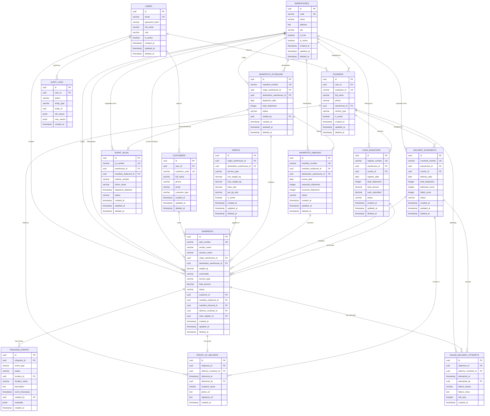

# Entity Relationship Diagram - DAPK Database

Complete database schema visualization showing all entities and their relationships.

---

## Complete ERD

---

## Key Relationships Explained

### Master Data
- **Users** can be linked to **Couriers** (for mobile app access) or **Customers** (for portal access)
- **Warehouses** serve as origin, destination, and current location for shipments
- **Tariffs** define pricing between warehouse pairs

### Shipment Flow
1. **Shipment** created at origin warehouse
2. Added to **Manifests_Outbound** for transport
3. **Surat_Jalan** documents handover to driver
4. **Manifests_Inbound** records arrival at destination
5. **Delivery_Runsheet** assigns to courier
6. **Proof_of_Delivery** captures successful delivery
7. **Cash_Register** reconciles COD payments

### Audit Trail
- **Tracking_Events** provides immutable history for each shipment
- **Audit_Logs** records all system actions for compliance

---

## Cardinality Notes

- **One-to-Many**: Most relationships (one warehouse has many shipments)
- **One-to-One**: Shipment to POD (one shipment has one proof of delivery)
- **Optional**: Many foreign keys nullable (shipment may not have manifest yet)
- **Immutable**: Tracking events and POD cannot be updated or deleted

---

**Related Documentation**:
- [Schema Definitions SQL](schema-definitions.sql)
- [Database Overview](schema-overview.md)
- [Soft Delete Strategy](soft-delete-strategy.md)
