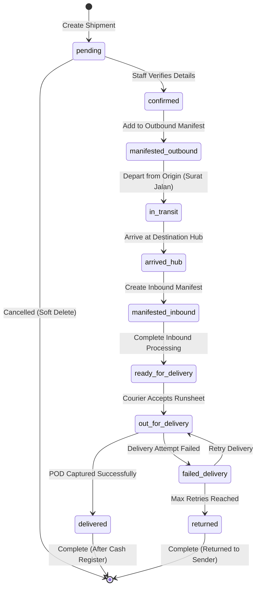

# Shipment Lifecycle - Complete Flow

Complete end-to-end flow of a shipment from creation to delivery.

---

## Shipment Status State Machine

---

## Status Definitions

### pending
**Description**: Shipment created, awaiting verification

**Actions Available**:
- Edit shipment details
- Print receipt
- Cancel/soft delete

**Next Status**: confirmed

**Duration**: Typically < 1 hour

---

### confirmed
**Description**: Shipment verified and ready for manifest

**Actions Available**:
- Add to outbound manifest
- Edit details (limited)
- Cancel/soft delete

**Tracking Event**: "Shipment confirmed at [Origin]"

**Next Status**: manifested_outbound

**Duration**: Until next manifest creation (same day or next day)

---

### manifested_outbound
**Description**: Added to outbound manifest, ready for transport

**Actions Available**:
- View manifest details
- (Cannot edit or remove once manifest is sealed)

**Tracking Event**: "Added to manifest [MO-NUMBER]"

**Next Status**: in_transit

**Duration**: Until manifest departs (hours to 1 day)

---

### in_transit
**Description**: En route to destination warehouse

**Actions Available**:
- Track current location (if GPS enabled)
- View estimated arrival

**Tracking Event**: "Departed from [Origin] to [Destination]"

**Next Status**: arrived_hub

**Duration**: Based on distance (1-3 days typically)

---

### arrived_hub
**Description**: Arrived at destination warehouse, awaiting processing

**Actions Available**:
- Create inbound manifest
- Report if shipment not received

**Tracking Event**: "Arrived at [Destination Hub]"

**Next Status**: manifested_inbound

**Duration**: Same day processing

---

### manifested_inbound
**Description**: Processed in inbound manifest, verified received

**Actions Available**:
- Create delivery runsheet
- Assign to courier

**Tracking Event**: "Processed at [Destination], ready for delivery"

**Next Status**: ready_for_delivery

**Duration**: Until runsheet created (same day)

---

### ready_for_delivery
**Description**: At destination hub, awaiting courier assignment

**Actions Available**:
- Assign to runsheet
- Assign to specific courier

**Tracking Event**: "Ready for delivery"

**Next Status**: out_for_delivery

**Duration**: Until supervisor creates runsheet (same day to 1 day)

---

### out_for_delivery
**Description**: Courier has shipment, attempting delivery

**Actions Available**:
- Courier: Submit POD
- Courier: Mark as failed delivery
- Track real-time location (if GPS)

**Tracking Event**: "Out for delivery with courier [Name]"

**Next Status**: delivered OR failed_delivery

**Duration**: Same day

---

### delivered
**Description**: Successfully delivered to recipient

**Actions Available**:
- View POD (photo, signature)
- Add to cash register (if COD)
- Generate invoice

**Tracking Event**: "Delivered to [Recipient Name] at [Time]"

**Next Status**: Complete (after cash register reconciliation)

**POD Requirements**:
- Recipient name
- Recipient signature or photo
- Delivery timestamp
- GPS coordinates (optional)

---

### failed_delivery
**Description**: Delivery attempt unsuccessful

**Actions Available**:
- Schedule retry
- Change address
- Return to sender

**Tracking Event**: "Delivery failed - [Reason]"

**Common Failure Reasons**:
- Recipient unavailable
- Wrong address
- Refused by recipient
- Security restriction
- Weather/access issue

**Next Status**: out_for_delivery (retry) OR returned

**Retry Policy**: Up to 3 attempts over 3 days

---

### returned
**Description**: Shipment being returned to sender

**Actions Available**:
- Notify sender
- Process refund/credit
- Create return manifest

**Tracking Event**: "Returned to sender - [Reason]"

**Final Status**: Complete

---

## Complete Shipment Journey

### Stage 1: Shipment Creation (Origin)

**Actor**: Warehouse Staff / Customer

**Steps**:
1. Enter sender and receiver details
2. Input weight, dimensions, commodity
3. Select service type (regular/express)
4. System calculates tariff automatically
5. System generates unique AWB number
6. Print receipt with barcode
7. Status: `pending` → `confirmed`

**Tracking Event**: "Shipment created at [Origin Warehouse]"

**Documents Generated**:
- Receipt with AWB barcode
- Sender copy
- Archive copy

---

### Stage 2: Outbound Manifest (Origin)

**Actor**: Warehouse Supervisor

**Steps**:
1. Select destination warehouse
2. Scan/add shipments going to same destination
3. System validates all shipments status = `confirmed`
4. Review manifest summary (count, weight, amount)
5. Seal manifest (no more changes)
6. Print manifest document
7. All shipments: status → `manifested_outbound`

**Tracking Event**: "Added to outbound manifest [MO-NUMBER]"

**Business Rules**:
- Only confirmed shipments can be added
- All shipments must have same destination
- Manifest must have at least 1 shipment
- Once sealed, cannot add/remove shipments

---

### Stage 3: Warehouse Handover (Surat Jalan)

**Actor**: Warehouse Staff + Driver

**Steps**:
1. Create surat jalan for manifest(s)
2. Enter vehicle details (type, number)
3. Enter driver details (name, phone, ID)
4. Warehouse staff signs document
5. Driver signs document
6. Driver departs with manifest(s)
7. All shipments: status → `in_transit`

**Tracking Event**: "Departed from [Origin] via [Vehicle Number]"

**Documents**:
- Surat jalan with signatures
- Driver copy
- Warehouse copy

---

### Stage 4: Transit

**Actor**: Transport Driver

**Duration**: 1-3 days (depending on distance)

**Activities**:
- Physical transport of packages
- (Future: GPS tracking updates)
- Estimated arrival time calculated

**Tracking Event**: (Optional) "In transit, expected arrival [Date]"

---

### Stage 5: Arrival at Destination

**Actor**: Destination Warehouse Staff

**Steps**:
1. Receive vehicle at destination
2. Verify surat jalan and manifest numbers
3. Unload shipments
4. Scan shipments to confirm receipt
5. All shipments: status → `arrived_hub`

**Tracking Event**: "Arrived at [Destination Hub]"

---

### Stage 6: Inbound Manifest (Destination)

**Actor**: Destination Warehouse Staff

**Steps**:
1. Create inbound manifest
2. Link to outbound manifest
3. Scan each shipment received
4. System validates against outbound manifest
5. If discrepancy: record missing shipments
6. Complete inbound processing
7. All received shipments: status → `ready_for_delivery`

**Tracking Event**: "Processed at [Destination], ready for delivery"

**Discrepancy Handling**:
- If shipments missing: Report to supervisor
- If extra shipments: Investigation required
- Update outbound manifest notes

---

### Stage 7: Delivery Runsheet Assignment

**Actor**: Delivery Supervisor

**Steps**:
1. View shipments `ready_for_delivery`
2. Group by delivery area/route
3. Create runsheet for specific route
4. Assign to available courier
5. Print runsheet document
6. Courier receives mobile notification
7. All shipments in runsheet: status remains `ready_for_delivery`

**Tracking Event**: "Assigned to courier [Name] for delivery"

**Optimization**:
- Group nearby addresses
- Consider shipment size/weight
- Balance courier workload
- Prioritize express shipments

---

### Stage 8: Courier Accepts Runsheet

**Actor**: Courier (via Mobile App)

**Steps**:
1. Courier opens mobile app
2. View assigned runsheet(s)
3. Review shipment list and addresses
4. Accept runsheet
5. All shipments: status → `out_for_delivery`
6. Courier loads shipments into vehicle
7. Begin delivery route

**Tracking Event**: "Out for delivery with courier [Name]"

**Mobile App Shows**:
- Total shipments count
- Route map (future feature)
- Recipient addresses and phone numbers
- COD amounts to collect

---

### Stage 9: Delivery Attempt

**Actor**: Courier

**Scenario A: Successful Delivery**

1. Navigate to recipient address
2. Contact recipient by phone
3. Hand over package
4. Capture POD:
   - Photo of recipient with package
   - Digital signature or photo of signed receipt
   - Recipient name
   - Relationship (self, family, security, etc.)
5. If COD: Collect payment
6. Submit POD via mobile app
7. Shipment: status → `delivered`

**Tracking Event**: "Delivered to [Recipient Name] at [HH:MM]"

**Scenario B: Failed Delivery**

1. Navigate to recipient address
2. Attempt contact (call, doorbell)
3. Recipient unavailable or other issue
4. Capture failure details:
   - Failure reason (unavailable, wrong address, refused, etc.)
   - Photo of location (optional)
   - Notes
5. Mark will retry (yes/no)
6. Submit via mobile app
7. Shipment: status → `failed_delivery`

**Tracking Event**: "Delivery failed - [Reason]"

**Retry Logic**:
- Attempt 1: Failed, retry next day
- Attempt 2: Failed, retry next day
- Attempt 3: Failed, contact customer or return to sender

---

### Stage 10: Cash Register Reconciliation

**Actor**: Courier + Finance Team

**Steps**:
1. End of day: Courier returns to warehouse
2. Finance creates cash register for courier
3. System lists all shipments delivered today by courier
4. Calculate total COD amount
5. Courier submits physical cash
6. Finance counts and verifies amount
7. If match: Verify and close register
8. If mismatch: Record discrepancy, escalate to manager
9. All shipments: `cash_register_id` updated

**Tracking Event**: "Cash registered and reconciled"

**Discrepancy Handling**:
- If short: Courier may be responsible
- If over: Return excess to customer
- Document discrepancy with notes
- Manager review and approval required

---

### Stage 11: Completion

**Shipment journey complete when**:
- Status = `delivered`
- POD captured and stored
- Cash reconciled (if COD)
- Invoice generated (if applicable)

**Final Tracking Event**: "Shipment completed"

---

## Exception Flows

### Lost Shipment (Unoutbound)

**Trigger**: Shipment status = `confirmed` for > 24 hours

**Report**: Uncashregister Report

**Action**:
- Supervisor reviews report daily
- Investigate why not in manifest
- Add to manifest or cancel

---

### Lost in Transit (Uninbound)

**Trigger**: Shipment status = `in_transit` for > 72 hours

**Report**: Uninbound Report

**Action**:
- Contact transport driver
- Check surat jalan
- File missing shipment report
- Insurance claim if applicable

---

### Not Assigned to Courier (Undelivery)

**Trigger**: Shipment status = `ready_for_delivery` for > 48 hours

**Report**: Undelivery Runsheet Report

**Action**:
- Supervisor creates runsheet immediately
- Or contact customer for pickup

---

### Cash Not Reconciled (Uncashregister)

**Trigger**: Shipment status = `delivered` but no `cash_register_id`

**Report**: Uncashregister Report

**Action**:
- Follow up with courier
- Submit cash register entry
- Or report theft/loss

---

## Timeline Example

**Typical Regular Service (Jakarta to Surabaya)**:

| Day | Time | Status | Location |
|-----|------|--------|----------|
| Day 1 | 09:00 | pending | Jakarta Hub |
| Day 1 | 09:05 | confirmed | Jakarta Hub |
| Day 1 | 14:00 | manifested_outbound | Jakarta Hub |
| Day 1 | 18:00 | in_transit | On Vehicle |
| Day 2 | 06:00 | arrived_hub | Surabaya Hub |
| Day 2 | 08:00 | manifested_inbound | Surabaya Hub |
| Day 2 | 09:00 | ready_for_delivery | Surabaya Hub |
| Day 2 | 10:00 | out_for_delivery | With Courier |
| Day 2 | 14:30 | delivered | Recipient Location |

**Total Time**: ~29.5 hours (1.2 days)

---

**Express Service**: 30-50% faster
**Remote Areas**: Add 1-2 days

---

## Related Documentation

- [Database Schema - Shipments Table](../03-database/tables/shipments.md)
- [API - Shipments Endpoints](../04-api/endpoints/core-system/shipments.md)
- [Tracking Events](../03-database/tables/tracking-events.md)
